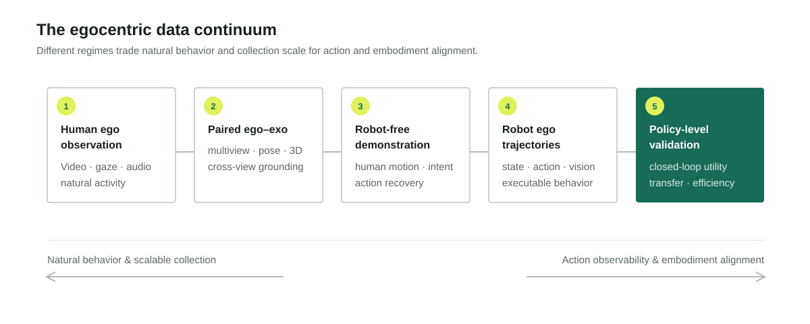
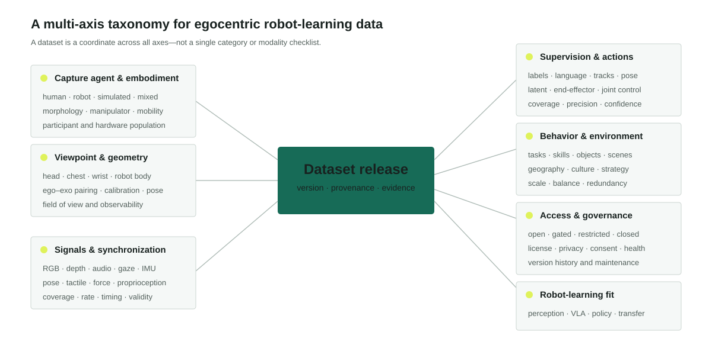
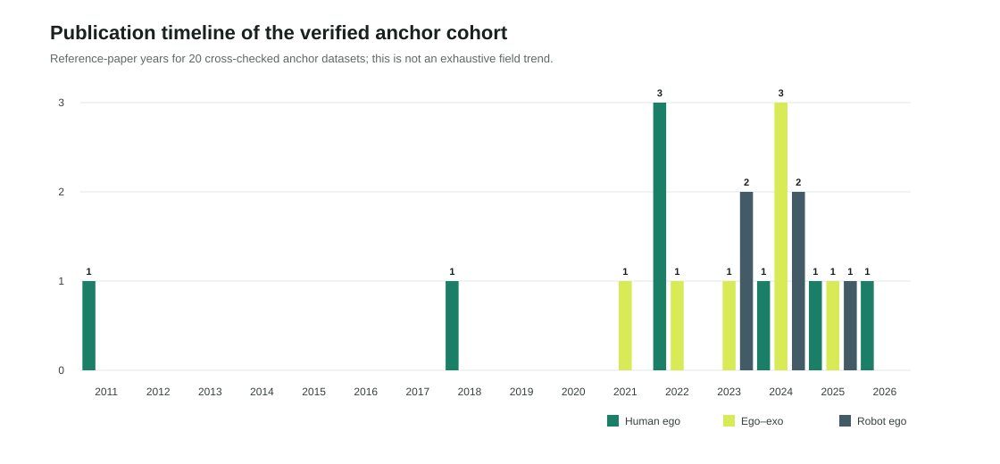
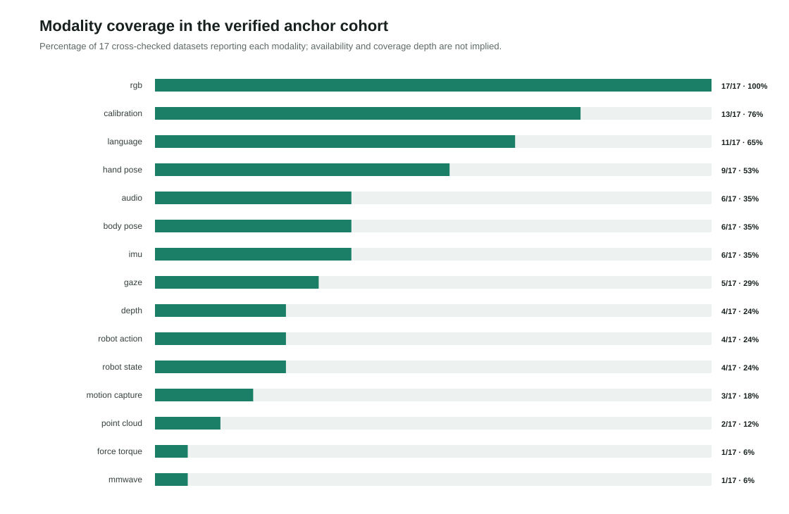
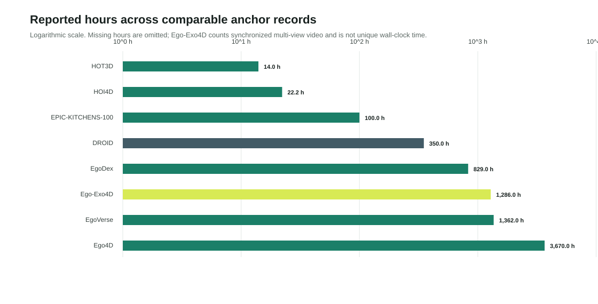
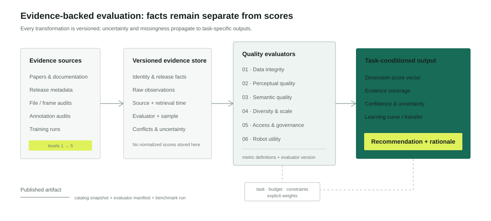

# ProjectEgo: From Human Egocentric Data to Robot Learning

## A Systematic Survey, Dataset Audit, and Utility Benchmark

**Qiao Sun et al.**  
**ProjectEgo Working Paper · Draft v0.1 · 25 July 2026**

> **Draft status.** This manuscript establishes the scope, taxonomy, and evaluation framework of ProjectEgo. Dataset counts, comparative scorecards, and downstream benchmark results will be added only after completion of the registered screening, dual extraction, and reproducible evaluation procedures described in the [review protocol](SURVEY_PROTOCOL.md). Values attributed to individual datasets below are reported by their primary sources unless explicitly marked as ProjectEgo-verified.

## Abstract

Egocentric data record the world from the situated viewpoint of an acting human or robot. This perspective exposes hands, manipulated objects, attention, motion, language, and environmental context in a form that is potentially valuable for robot perception and control. Yet the rapidly expanding dataset landscape remains fragmented across egocentric vision, wearable sensing, human activity understanding, imitation learning, and large-scale robot learning. Existing surveys primarily organize methods and visual tasks, while dataset catalogs commonly emphasize scale and modality without testing data integrity or downstream utility. Consequently, researchers lack a reproducible basis for deciding which human or robot egocentric datasets are suitable for a particular robot-learning objective.

This survey introduces **ProjectEgo**, a living dataset observatory and evidence-backed benchmark for egocentric robot learning. We first define the field through a continuum spanning human egocentric observation, paired ego–exo capture, robot-free demonstration, robot egocentric trajectories, and policy-level validation. We then propose a unified taxonomy over capture agent, viewpoint, sensing, supervision, embodiment alignment, access, and intended use. To distinguish dataset availability from dataset value, we organize quality into six auditable dimensions: integrity, perceptual quality, semantic quality, diversity and scale, access and governance, and robot utility. Every claim and score is coupled to provenance, evaluation level, uncertainty, and timestamp. Finally, we formulate the **Ego-to-Robot Gap** as a set of observable mismatches in viewpoint, embodiment, action, dynamics, intent, and environment, and outline fixed-budget experiments for measuring transfer rather than inferring it from metadata. ProjectEgo is designed to support a continuously updated survey, machine-readable catalog, open auditing toolkit, and task-specific leaderboard.

**Keywords:** egocentric vision, first-person video, robot learning, human demonstration, vision-language-action models, dataset quality, embodied AI, data-centric AI

**Figure 1. ProjectEgo scope.** Datasets occupy a continuum rather than a binary human/robot division. Moving right generally increases action and embodiment alignment but also collection cost. ProjectEgo evaluates each dataset at the highest evidence level supported by observable artifacts.

## 1. Introduction

The scaling of foundation models has changed the central data question in robotics. The problem is no longer only how to collect demonstrations for one robot and one task, but how to assemble experience broad enough to support transferable perception, reasoning, and behavior. Robot-native data offer executable actions and embodiment-consistent observations, but are expensive, slow, hardware-specific, and operationally constrained. Human egocentric data are abundant by comparison and capture diverse natural behavior, long-horizon intent, dexterous interaction, and open-world context. Their promise is therefore compelling: learn from what humans see and do, then transfer that knowledge to robots.

This promise is not automatic. A first-person video can show *what* happened while omitting the forces, joint states, control commands, geometry, or counterfactual failures required to reproduce it. A million hours of poorly aligned video may be less useful for policy learning than a smaller dataset with calibrated cameras, synchronized hand pose, language, and recoverable actions. Conversely, robot trajectories with precise controls may be narrow in objects, scenes, tasks, and behavioral strategies. Dataset value is conditional on the target task and on the transformation that connects recorded experience to executable behavior.

Egocentric vision has a substantial survey tradition. Early reviews documented the evolution of first-person visual methods and wearable-camera applications [1], later work examined hand analysis [2], anticipation [3], and the future of always-on egocentric perception [4]. Recent surveys synthesize the fast-growing task and method landscape [5]. These works are essential, but their organizing question is usually *what can a model infer from first-person observations?* ProjectEgo asks a complementary data-centric question:

> **Which egocentric data, under which evidence and budget, are useful for which robot-learning objective?**

Three developments make this question timely. First, large-scale efforts such as EPIC-KITCHENS [6], Ego4D [7], and Ego-Exo4D [8] expanded first-person data from small task-specific collections to diverse, multimodal, and geographically distributed resources. Second, robot data ecosystems such as Open X-Embodiment [9], BridgeData V2 [10], and DROID [11] demonstrated that heterogeneous trajectories can be standardized and used for cross-robot learning. Third, systems including EgoZero [12], robot-free imitation approaches, and EgoVerse [13] increasingly test whether egocentric human demonstrations can directly improve robot policies.

The resulting landscape crosses communities that use incompatible terminology, formats, access procedures, and evaluation conventions. Dataset descriptions often mix reported and measured quantities. Releases evolve without stable version histories. URLs fail, licenses remain ambiguous, and benchmark splits or annotation extensions are mistaken for independent datasets. Most importantly, scale, quality, and utility are frequently conflated.

ProjectEgo addresses this gap through four contributions:

1. **A unified scope and taxonomy** connecting human ego, ego–exo, robot-free and robot-native data.
2. **An evidence-backed catalog model** that versions dataset releases and traces individual claims to sources.
3. **A multidimensional quality standard** that separates observable quality from task-specific robot utility.
4. **A utility benchmark design** based on learning curves, fixed budgets, cross-dataset transfer, and uncertainty.

## 2. Review Methodology

The review follows the public [ProjectEgo systematic review protocol](SURVEY_PROTOCOL.md). The protocol is intentionally registered before full screening so that inclusion criteria and synthesis choices cannot be silently adjusted to fit a preferred narrative.

### 2.1 Research questions

The survey addresses six questions:

- **RQ1: Landscape.** Which egocentric datasets exist and how have their capture, scale, access, and intended uses evolved?
- **RQ2: Representation.** Which observations, annotations, actions, and embodiment signals are recorded?
- **RQ3: Quality.** Which dataset properties can be measured reproducibly?
- **RQ4: Transfer.** Which mismatches govern transfer from human experience to robot behavior?
- **RQ5: Utility.** Which datasets or mixtures improve downstream learning under controlled budgets?
- **RQ6: Gaps.** Which tasks, environments, geographies, embodiments, and governance conditions are underrepresented?

### 2.2 Sources and search

The search covers scholarly indexes, major computer-vision and robotics venues, artifact registries, dataset hosts, project pages, challenge sites, citation graphs, and existing curated lists. The core query combines terms for egocentric viewpoint, dataset artifacts, and embodied or robot-learning relevance. Exact-name searches and backward/forward citation chaining are performed for every included anchor dataset.

### 2.3 Inclusion unit

The unit of analysis is a **versioned dataset release**, not a paper. A dataset family may contain an original release, a larger successor, an annotation extension, a benchmark split, and a mirror. These are represented as related records rather than collapsed into one row or double-counted as independent datasets.

Human first-person, robot-mounted, paired ego–exo, synthetic ego, and dataset mixtures are eligible. Third-person-only resources are excluded unless they provide paired observations or a material ego-transfer contribution. Publicly described proprietary datasets can be cataloged, but inaccessible properties cannot be scored as if files had been inspected.

### 2.4 Screening, extraction, and evidence

Archival-paper records undergo dual screening and dual extraction. Living-catalog additions may enter as provisional after one review, but are visibly marked until independently checked. Every material field links to one or more evidence objects. Conflicting reports are retained until adjudication.

ProjectEgo uses five evidence levels:

| Level | Name | Minimum basis | Permitted interpretation |
|---:|---|---|---|
| 1 | Claimed | Paper, official page, or maintainer statement | The source states the claim |
| 2 | Metadata | Structured metadata independently checked | The release describes the field consistently |
| 3 | Sampled | Documented sample of released files inspected | The claim holds for the audited sample |
| 4 | Verified | Full applicable automated audit | The claim holds for the accessible release within test limits |
| 5 | Validated | Controlled downstream experiment | A measured utility result exists for the stated task and budget |

This ladder prevents a common category error: a dataset can be well documented without being technically verified, and technically clean without being useful for a target policy.

### 2.5 First reproducible catalog snapshot

The first ProjectEgo discovery snapshot contains 109 candidate records imported, with attribution, from Open Data Eval and is supplemented by targeted searches of robot-learning ecosystems. Candidate status does not imply inclusion. From this pool and primary-source searches, we selected ten anchor releases spanning human ego, paired ego–exo, and robot ego regimes. Each anchor was checked against a primary paper and a second official or attributed source. The resulting [dataset master table](../data/catalog/dataset_master.csv) is evidence level 2 (`cross_checked_metadata`), not a file audit.

This deliberately small cohort tests the schema and analysis pipeline before scaling curation. Figures 4–6 describe only these ten anchors and must not be interpreted as exhaustive historical estimates.

## 3. What Counts as Egocentric Data for Robot Learning?

### 3.1 Viewpoint is necessary but insufficient

The conventional definition of egocentric vision centers on a wearable or body-mounted camera approximating the actor's visual field. For robot learning, viewpoint alone is too weak. A useful classification must also ask who acts, what is sensed, whether intent is observable, and whether an executable action representation exists.

We define an egocentric dataset as containing observations captured from, attached to, or intentionally approximating the situated viewpoint of an acting human, robot, or embodied agent. Robot-learning relevance arises when those observations support one or more of the following:

- learning perceptual representations for objects, hands, affordances, geometry, or state;
- learning temporal structure, intent, task progress, or language grounding;
- recovering human motion or action in a robot-compatible representation;
- pretraining or evaluating an embodied world model;
- learning, adapting, or evaluating a robot policy.

### 3.2 The data continuum

We organize the field into five non-exclusive regimes.

#### Human egocentric observation

Datasets such as EPIC-KITCHENS and Ego4D prioritize natural human activity and visual understanding. Their advantages include ecological validity, behavioral diversity, natural language, and scalable capture. Their principal limitation for control is the absence of directly executable robot actions.

#### Paired ego–exo and spatially grounded capture

Ego-Exo4D and related multiview resources align first-person observation with external views, pose, geometry, gaze, and expert descriptions. The exocentric view can reduce self-occlusion and support 3D reconstruction, while the ego view preserves situated attention and interaction. Pairing creates a bridge for learning view-invariant representations and recovering action geometry.

#### Robot-free human demonstrations

Smart glasses, handheld devices, instrumented gloves, and portable trackers can acquire demonstrations without occupying a robot. Systems such as EgoZero show that egocentric human capture can be transformed into morphology-agnostic representations and transferred to a robot with minimal or no robot demonstration data [12]. This regime offers strong scalability but depends critically on action recovery and embodiment alignment.

#### Robot egocentric trajectories

Robot-mounted cameras coupled with proprioception and action commands provide direct supervision for policy learning. Open X-Embodiment and DROID exemplify the benefits of large, heterogeneous robot-native collections [9,11]. Their disadvantages are collection cost, safety constraints, platform bias, and limited natural behavior compared with unconstrained human activity.

#### Synthetic and transformed ego data

Simulation, view synthesis, retargeting, and video-to-trajectory pipelines can fill missing state or action signals. They can also introduce systematic errors. ProjectEgo therefore records both the original capture regime and every transformation applied before training.

## 4. A Unified Dataset Taxonomy

**Figure 2. ProjectEgo taxonomy.** Each dataset is encoded along independent axes. This avoids treating modality lists as a sufficient description and makes human-to-robot alignment explicit.

### 4.1 Capture agent and embodiment

The actor may be a human, robot, simulated human, simulated robot, or mixed population. For robots, the embodiment includes morphology, manipulator, locomotion system, sensors, and control frequency. For humans, relevant properties include camera mounting, dominant hand, visible body parts, and whether additional instrumentation changes behavior.

### 4.2 Viewpoint and observability

Head-mounted video approximates gaze direction but does not guarantee gaze measurement. Wrist-mounted cameras improve local manipulation visibility but produce rapid motion and narrow context. Robot-head cameras support navigation and whole-body reasoning; robot-wrist cameras improve contact-scale observation. Paired exocentric views expose occluded geometry but may not be available at deployment.

Observability should be encoded at the signal level: camera intrinsics and extrinsics, timestamps, synchronization, depth validity, tracking confidence, field of view, exposure policy, dropped frames, and calibration drift.

### 4.3 Modalities

Relevant modalities extend beyond RGB:

- audio and speech;
- depth, stereo, point clouds, meshes, and scene reconstruction;
- gaze, head pose, hand pose, body pose, and object pose;
- IMU, odometry, SLAM trajectories, and camera calibration;
- tactile, force, torque, proprioception, and gripper state;
- natural language, narrations, task instructions, and expert commentary;
- robot actions, end-effector commands, joint commands, and low-level controls.

Availability is not binary. A modality may cover the full release, a subset, a derived product, or only be reported. ProjectEgo records coverage and provenance rather than placing an unchecked checkmark in a comparison table.

### 4.4 Supervision and temporal structure

Annotations range from clip labels to dense temporal boundaries, narrations, spatial masks, tracks, poses, contact states, skill segments, and preferences. Their value depends on accuracy, coverage, ontology consistency, temporal precision, and compatibility with target outputs. Long recordings preserve task context but raise segmentation and retrieval challenges; short demonstrations simplify learning but can remove recovery behavior and long-horizon intent.

### 4.5 Environment and behavior

The effective support of a dataset is determined by environments, objects, tasks, participants, geographies, cultures, devices, and behavioral strategies. Raw counts do not capture balance or redundancy. A thousand nearly identical episodes may contribute less diversity than a smaller set spanning meaningful variations. ProjectEgo will report both scale and distribution-aware coverage.

### 4.6 Access and governance

“Public” is not a sufficient access label. We distinguish open, gated-open, restricted, proprietary, unavailable, and unknown releases. We separately record license identity, commercial-use terms, application steps, data-use agreements, download health, privacy documentation, consent statements, and redistribution constraints. These factors directly affect reproducibility and real-world usability.

## 5. The Evolution of the Dataset Landscape

### 5.1 From scripted activities to open-world behavior

Early egocentric datasets were often small, scripted, and designed for activity recognition, object interaction, or lifelogging. Their controlled settings supported tractable evaluation but limited environmental and behavioral diversity. EPIC-KITCHENS scaled kitchen activities across participants and introduced influential action-recognition and anticipation benchmarks [6]. Ego4D expanded toward thousands of hours, diverse locations and activities, multiple benchmark tasks, and multimodal subsets [7].

This evolution changes more than dataset size. It shifts the learning problem from closed-set recognition to episodic memory, forecasting, social understanding, language grounding, and long-form temporal reasoning. However, increased duration does not automatically increase manipulation density or robot relevance. Long recordings may contain substantial locomotion, idle time, social interaction, and visually uninformative segments. Action density and usable coverage must therefore be measured.

### 5.2 From monocular video to multimodal spatial capture

Project Aria and datasets built around similar devices pair video with gaze, IMU, calibration, audio, and spatial trajectories. Ego-Exo4D synchronizes egocentric and exocentric views with additional 3D and language signals [8]. Hand–object datasets emphasize object pose, hand pose, contact, and reconstruction. These signals support the geometry and correspondence needed to move beyond recognition toward action understanding and retargeting.

Yet richer sensors create new failure modes: synchronization offsets, invalid depth, calibration inconsistencies, coordinate-frame ambiguity, and partial modality coverage. A catalog must describe these signals, while an auditor must test them.

### 5.3 From vision datasets to robot-learning corpora

Robot-learning datasets historically remained tied to a single laboratory, robot, and task distribution. BridgeData V2 broadened manipulation scenes and skills [10]; Open X-Embodiment standardized datasets across many institutions and embodiments and demonstrated positive cross-robot transfer [9]; DROID collected large-scale in-the-wild robot manipulation data with a common hardware setup across many environments [11]. These efforts establish robot-native reference points for evaluating human-data transfer.

The central opportunity is not to replace robot data with human video universally. It is to determine how human and robot data complement one another. Human data may supply semantic diversity, natural task structure, and broad visual priors; robot data supplies executable dynamics and embodiment-specific grounding. The optimal mixture is likely task-, model-, and budget-dependent.

### 5.4 The emerging direct-transfer regime

Recent work increasingly treats egocentric human behavior as policy data rather than only representation data. EgoZero extracts robot-executable information from smart-glasses demonstrations and reports zero-robot-data transfer on a set of manipulation tasks [12]. EgoVerse reports a standardized human demonstration platform and multi-lab transfer study at substantially larger scale [13]. Other emerging systems address wrist alignment, active perception, humanoid manipulation, and video-to-trajectory reconstruction [14–16].

These results are promising but not directly comparable because capture devices, tasks, robot embodiments, policy architectures, data budgets, and success definitions differ. A utility benchmark must control these factors and reproduce results across datasets rather than aggregate headline success rates.

### 5.5 Preliminary cross-checked anchor statistics

**Figure 4. Reference-publication timeline of the first cross-checked anchor cohort.** Counts use the year of each primary dataset paper, which is stored separately from release year. They reflect ten deliberately selected anchors, not the prevalence of dataset regimes in the full literature.

**Figure 5. Reported modality coverage.** RGB is universal in this cohort, whereas robot state and action are confined to robot-native records. A reported modality can cover only part of a release; this chart does not encode completeness or file validity.

**Figure 6. Reported hours on a logarithmic scale.** Only records with reconciled hour values are shown. Ego-Exo4D reports combined synchronized multiview video rather than unique wall-clock activity; datasets described only in trajectories are omitted rather than converted using an assumed episode duration.

## 6. From Dataset Quality to Robot Utility

**Figure 3. Evidence-backed evaluation.** Facts and raw observations remain separate from normalized scores. Dataset comparisons are conditioned on task and budget, with uncertainty propagated to the final recommendation.

### 6.1 Why one universal score is invalid

A dataset may be excellent for action recognition and poor for policy learning. High-resolution video may help hand–object understanding but add storage cost without improving a language-conditioned policy. A restrictive research-only license may be acceptable in an academic benchmark and unusable for industrial development. Therefore ProjectEgo does not define an intrinsic universal “best dataset.”

Instead, each dataset receives a vector of dimension scores and evidence coverage. Task-specific recommendations apply explicit weights and hard constraints. Missing values remain missing; they are not silently converted to zero or imputed from dataset popularity.

### 6.2 Dimension I: Data integrity

Integrity asks whether the release can be consumed as intended. Candidate tests include:

- URL and manifest completeness;
- corrupt, truncated, or unreadable files;
- duplicate and near-duplicate sequences;
- frame continuity and timestamp monotonicity;
- audio-video and multimodal synchronization;
- calibration validity and coordinate-frame consistency;
- split leakage and identity overlap;
- schema, checksum, and loader reproducibility.

Integrity tests should run at file or release level where feasible. Sampling is reported explicitly when full inspection is impractical.

### 6.3 Dimension II: Perceptual quality

Perceptual quality is task-conditioned visibility, not aesthetic quality. Measures include sharpness, exposure, compression, motion blur, occlusion, hand visibility, object visibility, contact visibility, camera motion, and action density. Thresholds must be calibrated against downstream performance rather than chosen only from conventional video standards.

### 6.4 Dimension III: Semantic quality

Semantic quality covers label correctness, agreement, completeness, ontology coherence, temporal grounding, spatial precision, language specificity, and annotation provenance. Automatically generated labels are not inherently low-quality, but their model, confidence, and validation procedure must be recorded. Annotation quantity and annotation reliability are reported separately.

### 6.5 Dimension IV: Diversity and scale

Scale is represented by multiple quantities rather than one headline number: duration, episodes, trajectories, frames, participants, environments, tasks, objects, and geographic coverage. Diversity metrics should account for entropy, imbalance, redundancy, and effective sample size. Saturation-aware transformations prevent a tenfold increase in hours from overwhelming all other dimensions.

### 6.6 Dimension V: Access and governance

This dimension evaluates whether claims can be reproduced and whether the data can be used responsibly. It includes license clarity, commercial-use clarity, access delay, download reliability, documentation, loaders, version history, privacy and consent information, removal mechanisms, and known restrictions. ProjectEgo reports factual summaries, not legal advice.

### 6.7 Dimension VI: Robot utility

Robot utility must be measured through controlled experiments. We distinguish:

- **representation utility:** improvement in frozen or fine-tuned perception and state estimation;
- **semantic utility:** improvement in language grounding, task recognition, or planning;
- **action utility:** improvement in action prediction or trajectory recovery;
- **policy utility:** improvement in closed-loop task success;
- **transfer utility:** improvement on new environments, objects, tasks, or embodiments;
- **data efficiency:** gain per hour, episode, byte, annotation cost, or GPU-hour.

Utility is reported as a learning curve with uncertainty, not only as a terminal score.

## 7. The Ego-to-Robot Gap

We define the Ego-to-Robot Gap as a vector of mismatches rather than a single domain distance:

\[
\mathbf{G}_{E\rightarrow R} =
[G_v, G_e, G_a, G_d, G_i, G_s, G_g],
\]

where the components correspond to viewpoint, embodiment, action, dynamics, intent, sensing, and environment/governance gaps.

### 7.1 Viewpoint gap

Human head motion, eye height, field of view, and hand visibility differ from robot head or wrist cameras. Viewpoint alignment can be addressed through paired views, geometric reconstruction, view synthesis, augmentation, or representation learning, but each method may discard information or introduce artifacts.

### 7.2 Embodiment gap

Human hands differ from parallel grippers, multi-finger hands, mobile manipulators, and humanoids in kinematics, reachability, compliance, and contact strategies. Morphology-agnostic representations can reduce this gap, but may remove task-relevant dexterity.

### 7.3 Action and dynamics gap

Video does not directly expose motor commands, forces, impedance, or system dynamics. Action recovery may use hand pose, object motion, inverse dynamics, retargeting, or learned latent actions. Identical visual outcomes can arise from different controls, making action inference underdetermined.

### 7.4 Intent and temporal gap

Human demonstrations contain implicit goals, habits, corrections, and irrelevant behavior. Language and task segmentation can expose intent, while long-horizon context helps distinguish subgoals. Over-segmentation can erase recovery and planning structure.

### 7.5 Sensing gap

Training may rely on gaze, depth, external views, or precise trajectories unavailable to the deployed robot. Benchmark protocols must distinguish training-only privileged information from deployment observations.

### 7.6 Environment and governance gap

Human data may be visually diverse but legally unusable, privacy-sensitive, or collected in environments unavailable for robot evaluation. Robot datasets may be legally clearer but concentrated in laboratories. Both statistical and operational domain gaps matter.

## 8. Proposed ProjectEgo Utility Benchmark

### 8.1 Evaluation principles

1. Hold model, optimizer, augmentation, compute, and evaluation protocol fixed when comparing datasets.
2. Compare datasets at matched examples, duration, storage, and compute budgets.
3. Report at least three seeds and confidence intervals for stochastic training.
4. Use held-out environments, objects, tasks, and embodiments.
5. Test mixtures and marginal contribution, not only single-source pretraining.
6. Publish manifests, checkpoints, failures, and energy/compute accounting.

### 8.2 Benchmark tracks

| Track | Input data | Target | Primary measure |
|---|---|---|---|
| Perception transfer | Ego video/multimodal | Hand, object, pose, affordance | Held-out accuracy and calibration |
| Representation transfer | Ego or robot video | Frozen embodied representation | Linear probe and few-shot transfer |
| Action recovery | Human ego sequences | Robot-compatible actions | Trajectory error and executability |
| VLA pretraining | Video, language, optional actions | Robot task policy | Success under fixed compute |
| Policy augmentation | Robot data + candidate ego data | Closed-loop manipulation | Marginal success gain |
| Cross-dataset transfer | Dataset A train, B test | Generalization | Transfer matrix and worst-group score |

### 8.3 Learning-curve evaluation

For dataset \(D\), task \(T\), and budget \(b\), let \(U(D,T,b)\) be downstream utility. We report the curve across budgets and its normalized area:

\[
\operatorname{AUC}_{D,T} =
\frac{1}{b_{\max}-b_{\min}}
\int_{b_{\min}}^{b_{\max}} U(D,T,b)\,db.
\]

For mixtures, the marginal contribution of dataset \(D_i\) to base mixture \(M\) is:

\[
\Delta U(D_i\mid M,T,b)=U(M\cup D_i,T,b)-U(M,T,b).
\]

These measurements reveal saturation, complementarity, and negative transfer that a single full-budget score obscures.

### 8.4 Recommendation, not universal ranking

Given user constraints \(C\) and explicit task weights \(\mathbf{w}_T\), a recommendation may combine normalized dimension scores \(\mathbf{s}_D\), evidence confidence \(c_D\), and measured utility. Hard constraints such as license or modality are applied before ranking:

\[
R(D\mid T,C) = \mathbb{1}[D\models C]\; c_D\;
\mathbf{w}_T^\top \mathbf{s}_D.
\]

The interface must show the weights, exclusions, missing fields, and sensitivity of the ordering. The formula is a decision aid, not a claim of intrinsic dataset worth.

## 9. Open Research Problems

### 9.1 Measuring useful diversity

Dataset hours are easy to report and poor at measuring semantic support. The field needs task-conditioned coverage measures that distinguish new behavior from repeated recording and connect diversity to generalization.

### 9.2 Recovering action without overstating certainty

Inferring executable actions from monocular video is fundamentally ambiguous. Future datasets should provide synchronized geometry, hand/object pose, confidence, and limited calibration sequences where possible. Benchmarks should measure both reconstruction accuracy and closed-loop executability.

### 9.3 Data mixtures and attribution

Foundation-model training rarely uses one dataset. Determining which source contributes which capability requires mixture ablations, influence estimates, retrieval analyses, and contamination controls. ProjectEgo will treat dataset portfolio design as a first-class problem.

### 9.4 Evaluation contamination

Public egocentric videos may appear in web-scale pretraining, and related participants, scenes, or clips may cross dataset splits. Perceptual hashing, metadata matching, identity-aware splits, and model provenance are necessary for credible evaluation.

### 9.5 Closed data and unverifiable scale

Industrial datasets can influence the field through published model results while remaining inaccessible. ProjectEgo will catalog public facts and distinguish them from audited evidence. Closed scale claims will not receive inferred file-quality or utility scores.

### 9.6 Privacy, consent, and bystanders

Egocentric cameras capture homes, workplaces, screens, conversations, and bystanders. Redaction may alter learning signals; consent can be difficult to obtain continuously; model training may retain sensitive information. Dataset quality must include governance and risk, not only model performance.

### 9.7 Dynamic datasets require dynamic scholarship

Static survey tables become outdated as links, licenses, releases, and annotations change. The survey should cite a frozen snapshot while the online catalog continues to evolve. Corrections must preserve history and propagate to derived analyses.

## 10. Limitations of This Draft

This v0.1 manuscript is a framework and narrative synthesis, not the final systematic review. It does not yet report a PRISMA flow, complete dataset count, meta-analysis, inter-reviewer agreement, or ProjectEgo-generated quality and utility results. Recent 2025–2026 preprints have not all undergone peer review. Reported dataset scale and performance values must be independently extracted and verified before inclusion in comparative tables. The current taxonomy may change after pilot dual extraction exposes ambiguous cases.

## 11. Conclusion

Egocentric data provide an unusually rich record of situated behavior, but their value for robot learning cannot be inferred from viewpoint or scale alone. Human video, paired multiview capture, robot-free demonstrations, robot trajectories, and synthetic transformations provide different combinations of diversity, observability, action alignment, cost, and risk. Treating them as interchangeable obscures the central scientific problem.

ProjectEgo reframes the field around evidence-backed dataset decisions. It separates claims from measurements, quality from utility, and universal catalog facts from task-specific recommendations. The intended outcome is not another static list, but a shared infrastructure through which the community can discover data, audit releases, reproduce scores, measure transfer, and improve the standards by which embodied-learning datasets are built.

## References

[1] A. Betancourt, P. Morerio, C. S. Regazzoni, and M. Rauterberg. “The Evolution of First Person Vision Methods: A Survey.” *IEEE Transactions on Circuits and Systems for Video Technology*, 2015. [doi:10.1109/TCSVT.2015.2409731](https://doi.org/10.1109/TCSVT.2015.2409731).

[2] A. Bandini and J. Zariffa. “Analysis of the Hands in Egocentric Vision: A Survey.” *IEEE Transactions on Pattern Analysis and Machine Intelligence*, 2023. [doi:10.1109/TPAMI.2020.2986648](https://doi.org/10.1109/TPAMI.2020.2986648).

[3] Y. Yao et al. “Predicting the Future from First Person (Egocentric) Vision: A Survey.” 2021. [arXiv:2107.13411](https://arxiv.org/abs/2107.13411).

[4] C. Plizzari et al. “An Outlook into the Future of Egocentric Vision.” 2024. [arXiv:2308.07123](https://arxiv.org/abs/2308.07123).

[5] X. Li et al. “Challenges and Trends in Egocentric Vision: A Survey.” 2025. [arXiv:2503.15275](https://arxiv.org/abs/2503.15275).

[6] D. Damen et al. “Rescaling Egocentric Vision: Collection, Pipeline and Challenges for EPIC-KITCHENS-100.” *International Journal of Computer Vision*, 2022. [Project](https://epic-kitchens.github.io/2022).

[7] K. Grauman et al. “Ego4D: Around the World in 3,000 Hours of Egocentric Video.” *CVPR*, 2022. [arXiv:2110.07058](https://arxiv.org/abs/2110.07058).

[8] K. Grauman et al. “Ego-Exo4D: Understanding Skilled Human Activity from First- and Third-Person Perspectives.” *CVPR*, 2024. [arXiv:2311.18259](https://arxiv.org/abs/2311.18259).

[9] Open X-Embodiment Collaboration et al. “Open X-Embodiment: Robotic Learning Datasets and RT-X Models.” *ICRA*, 2024. [arXiv:2310.08864](https://arxiv.org/abs/2310.08864).

[10] H. Walke et al. “BridgeData V2: A Dataset for Robot Learning at Scale.” *CoRL*, 2023. [arXiv:2308.12952](https://arxiv.org/abs/2308.12952).

[11] A. Khazatsky et al. “DROID: A Large-Scale In-The-Wild Robot Manipulation Dataset.” *RSS*, 2024. [arXiv:2403.12945](https://arxiv.org/abs/2403.12945).

[12] V. Liu et al. “EgoZero: Robot Learning from Smart Glasses.” 2025. [arXiv:2505.20290](https://arxiv.org/abs/2505.20290).

[13] R. Punamiya et al. “EgoVerse: An Egocentric Human Dataset for Robot Learning from Around the World.” 2026. [arXiv:2604.07607](https://arxiv.org/abs/2604.07607).

[14] “WARPED: Wrist-Aligned Rendering for Robot Policy Learning from Egocentric Human Demonstrations.” 2026. [arXiv:2604.10809](https://arxiv.org/abs/2604.10809).

[15] “EgoHumanoid: Unlocking In-the-Wild Loco-Manipulation with Robot-Free Egocentric Demonstration.” 2026. [arXiv:2602.10106](https://arxiv.org/abs/2602.10106).

[16] “EgoEngine: From Egocentric Human Videos to High-Fidelity Dexterous Robot Demonstrations.” 2026. [arXiv:2606.12604](https://arxiv.org/abs/2606.12604).

---

### Citation and contribution

This is a living working paper. Please report missing datasets, factual corrections, or conflicting evidence through the [ProjectEgo issue tracker](https://github.com/qiaosun22/Project-Ego/issues). The archival manuscript will cite a frozen catalog release; the online survey will continue to receive versioned corrections.
